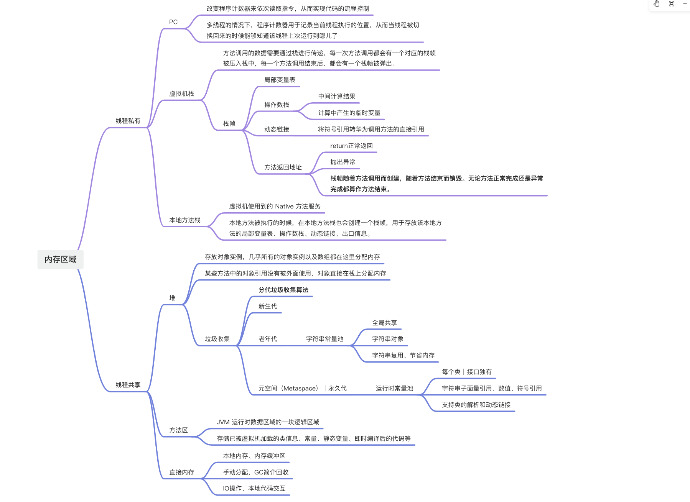
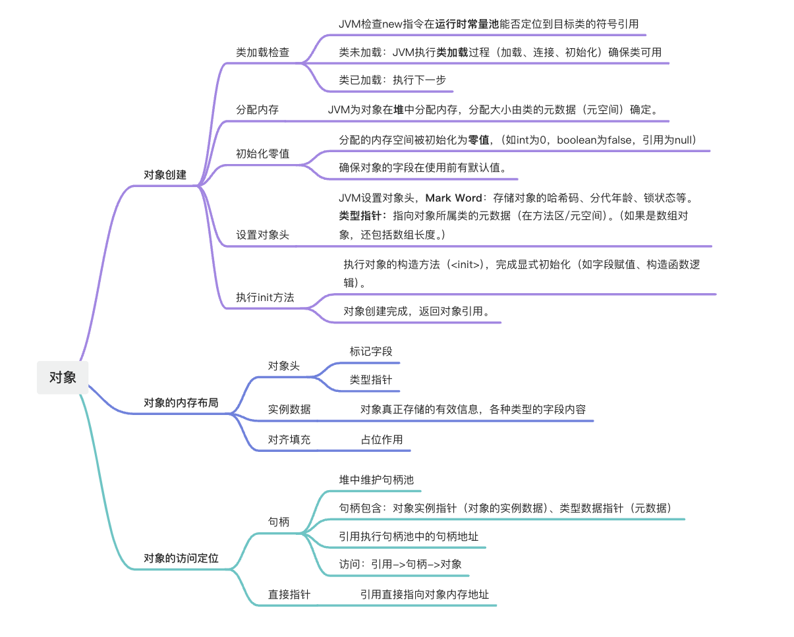
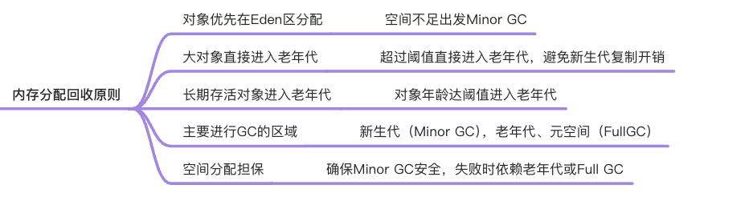
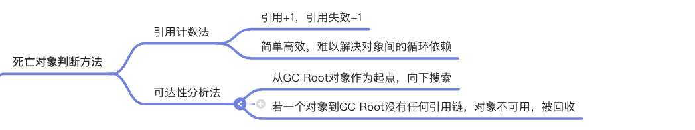
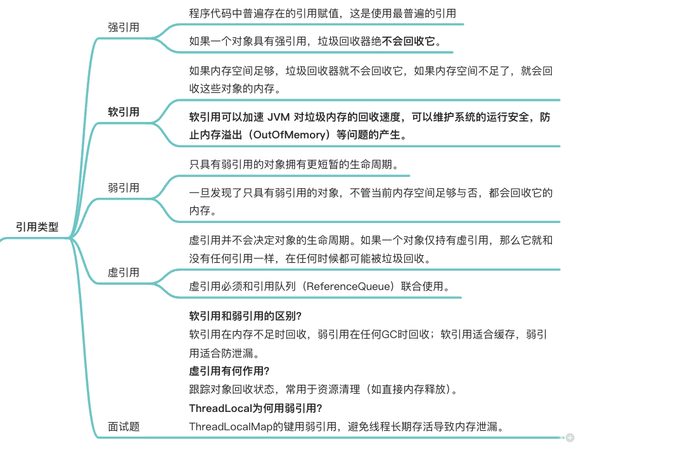
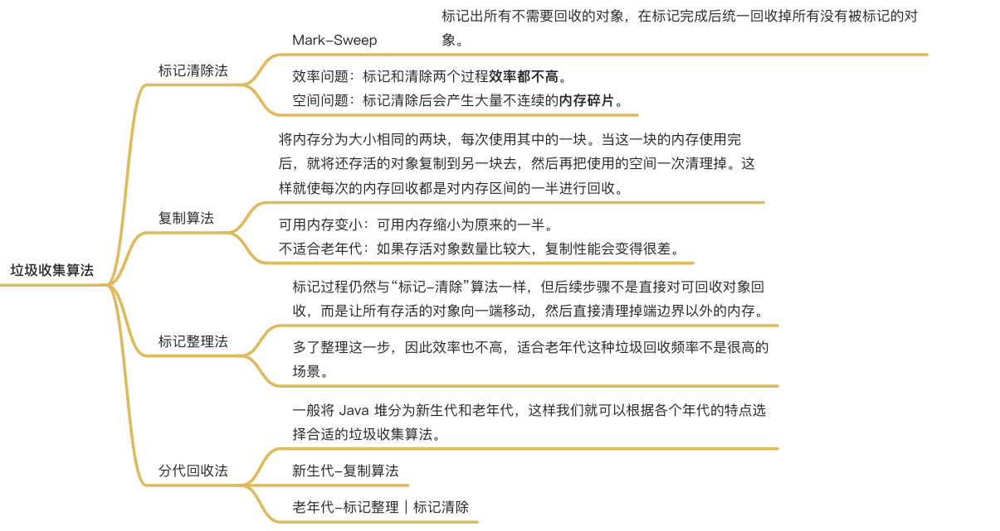
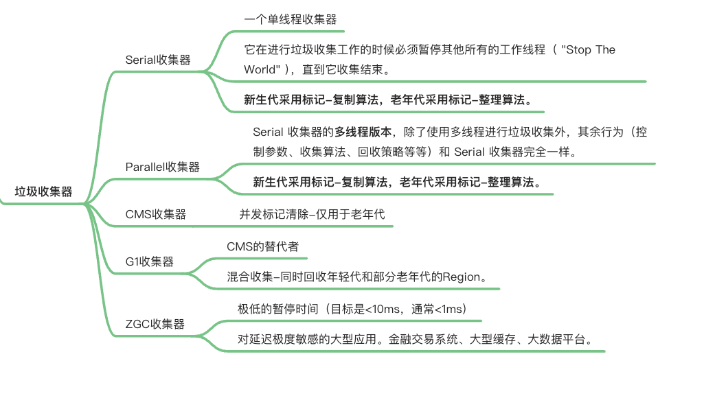

# JVM
## 内存区域

## 对象

## 垃圾回收

## JVM由哪些部分组成？

Java虚拟栈

1. 方法调用栈帧入栈，调用结束栈帧弹出。
2. 栈帧：局部变量表、操作数栈、动态链接、方法返回地址。
3. 栈大小不变：`StackOverFlowError`,栈大小改变`OutOfMemoryError`

本地方法栈

1. 虚拟机栈为虚拟机执行 Java 方法 （也就是字节码）服务，而本地方法栈则为虚拟机使用到的 Native 方法服务。
2. 栈大小不变：`StackOverFlowError`,栈大小改变`OutOfMemoryError`

堆
1. 几乎所有的对象实例以及数组都在这里分配内存
2. 为什么年龄只能是 0-15?年龄占4位

方法区
1. JVM 运行时数据区域的一块逻辑区域，是各个线程共享的内存区域。
2. 存储已被虚拟机加载的 类信息、字段信息、方法信息、常量、静态变量、即时编译器编译后的代码缓存等数据。

常量池

程序计数器

直接内存