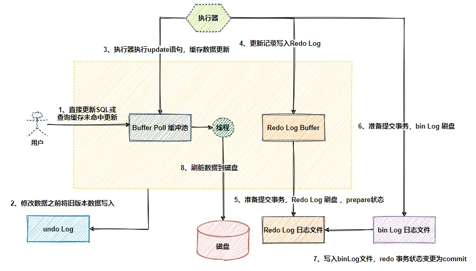
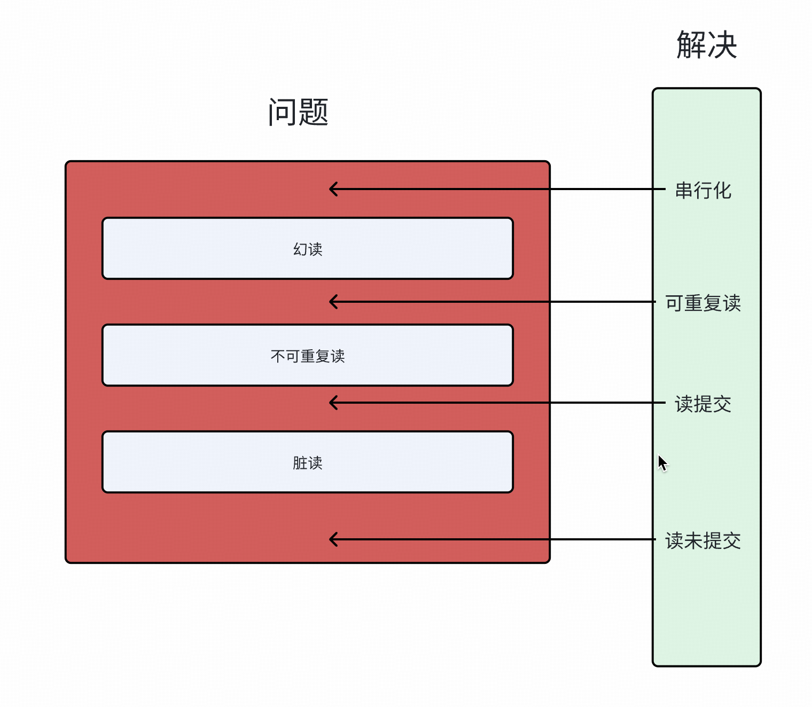

œ# MySQL

[JavaGuide-MySQL 面试](https://javaguide.cn/database/mysql/mysql-questions-01.html#mysql-%E5%9F%BA%E7%A1%80)

## Q1：varchar 的大小分配

1. 在实际使用中，我在创建表时设置了 `varchar(100)`，在编写业务代码使用时，发现插入数据错误，出现了对字符串大小评估不准确的问题。
2. 是按照字符计数，并不是按照字节计数，所以存放一个中文和英文的个数所消耗的字符个数是相同的。

## Q2：关于 Decimal 类型和 float/double 类型

1. `Decimal`类型存放的是定点数（存储精确的小数值），`float/double`是浮点数（只能存放近似值）。
2. Java 中如何使用数据库中对应的 Decimal 呢？
   ```java
   BigDecimal a = new BigDecimal("0.1"); // 精确
   // 方法
   a.add(b);
   a.subtract(b);
   a.multiply(b);
   BigDecimal x = new BigDecimal("10");
   BigDecimal y = new BigDecimal("3");
   // 必须指定舍入模式，否则可能抛出 ArithmeticException（除不尽时）
   BigDecimal result = x.divide(y, 4, RoundingMode.HALF_UP); // 10 ÷ 3 ≈ 3.3333
   ```

## Q3：不推荐使用 text 和 blob 类型，用什么方法代替呢？

1. 使用 OSS 云存储的方式，在数据库中只存放文件的 url。

## Q4：手机号在 mysql 中以 int 还是 varchar 存储？

> 以 `varchar`存储

1. 格式兼容与完整性：0 开头的号码，国家代码前缀
2. 非算数：手机号并不进行运算。
3. 查询灵活：like 模糊查询，如果为 int 需要`>=,<=,>,<`等操作。
4. 加密要求： 密文存储

## Q5：实际开发中 SQL 慢的原因？

1. 硬件资源不足，实际开发中很多情况下给 mysql 分配的内存大小不足。明明是专属与 sql 的服务器，但是内存空间分配极少。
2. mysql 参数配置不合理，检查并配置：`innodb_buffer_pool_size`、`query_cache_size`。
3. sql 语句分析，简化逻辑表达，减少复杂性。索引配置合理性？。

## Q6：为什么选择 b+树作为索引的结构呢？

> 索引是为了加速查询速度，所以对比多种查询算法，选择了 b+ 树作为索引的结构。

1. hash 索引：
   - 查询快，但是不支持范围查询。
   - 不支持排序。
2. 二叉查找树：
   - 二叉查找树的性能非常依赖于它的平衡程度，这就导致其不适合作为 MySQL 底层索引的数据结构。
3. AVL 树：
   - 旋转操作维持平衡有较大的计算开销
   - AVL 树莓哥节点仅存储一条数据，每次进行磁盘 IO 只能读取一盒节点的数据。磁盘 IO 耗时。
4. 红黑树：
   - 不严格平衡，大致平衡。
   - 内存中使用表现优异。
5. b 树：
   - 既存放数据也存放键。
   - 叶子节点相互独立，范围查找需要找到下限，然后遍历 b 树，直到找到上限。
   - 二分查找可能不到叶子节点查询结束。
6. b+ 树索引：
   - 支持范围查询，找到下限，对链表进行遍历即可。
   - 叶子节点之间通过指针连接，支持顺序访问。
   - 非叶子节点只存储键值和指针，不存储实际数据，减少了内存占用。
     > ✅b+树具备更少的 IO 次数、更稳定的查询效率、更适合范围查询。

## Q7：索引有哪些类型？

1. 聚簇索引和非聚簇索引：
   - 聚簇索引： 索引结构和数据结构存放一起的索引。
   - 非聚簇索引： 索引结构和数据结构分开存放的索引（二级索引），叶子节点存放了主键，根据主键回表查询。
2. 覆盖索引和联合索引
   - 覆盖索引： 索引包含了查询语句中的所有字段，不需要回表查询。
   - 联合索引： 多个字段组成的索引。
     - 最左前缀匹配原则：从左向右依次匹配查询条件中的字段。
     - 一直向右匹配，直到遇到范围查询（如 >、<）为止。对于`>=、<=、BETWEEN`以及前缀匹配 `LIKE `的范围查询，不会停止匹配。
     - 区分度高的在左边，过滤更多数据。

## Q8：索引下推是什么？

> 索引下推的 下推 其实就是指将部分上层（Server 层）负责的事情，交给了下层（存储引擎层）去处理。


    
1. 索引下推之前：
    - 存储引擎层：先根据索引查询到主键，二次查询：根据主键查询到数据，获取完整数据。
    - 存储引擎层：把所有数据交给server层，sever层根据下一个索引信息再筛选。
2. 索引下推之后：
    - 存储引擎层：依次根据索引条件查到对应数据的id，二次查询：根据id查到完整用户数据。
    - 存储引擎层：把符合条件的数据返回给server层。
3. 优势：
    - 减少回表次数之
    - 索引下推还可以减少存储引擎层和 Server 层的数据传输量。

## Q9：索引失效了？

[索引失效](https://mp.weixin.qq.com/s/mwME3qukHBFul57WQLkOYg)

1. 函数操作
2. 模糊匹配 like
3. 表达式计算
4. orderby 不加 limit 和 where

## Q10:mysql 的三大日志？

[mysql 三大日志](https://javaguide.cn/database/mysql/mysql-logs.html)<br/>
[mysql 数据不丢失的原因](https://mp.weixin.qq.com/s/3gREGG1tlytsaqO3aHoxkw)
<br/>


## MVCC 多版本并发控制

| 问题                     | 说明                                                                       |
| ------------------------ | -------------------------------------------------------------------------- |
| MVCC 是什么？            | ​​ 多版本并发控制，通过维护数据多个版本实现读写并发，不冲突                |
| ​ 解决什么问题？​​       | 解决读写互相阻塞的问题，提高并发性能                                       |
| ​InnoDB 如何实现？​      | ​ 通过 隐藏字段（`DB_TRX_ID`, `DB_ROLL_PTR`）、`Undo Log`、`ReadView` 实现 |
| ​ 核心思想 ​             | 读操作读的是某个历史版本快照，写操作创建新版本，互不干扰                   |
| ​ 依赖事务隔离级别       | ​ 主要用于 `READ COMMITTED` 和 `REPEATABLE READ`                           |
| ​ 默认隔离级别（MySQL）​ | `​REPEATABLE READ`，通过 MVCC 实现可重复读                                 |
| ​ 不适用场景 ​           | 当前读（加锁读）、写操作、`READ UNCOMMITTED` 等                            |

## Q11：事务的隔离级别？

> 多个事物并发时，发生了三种隔离性上的问题：脏读、不可重复读、幻读。针对这三类问题需要有对应的解决方案。读提交解决了脏读问题，可重复读解决了>不可重复读的问题，串行化解决了幻读的问题。mysql 默认为可重复读级别的隔离，它也提供了一些手段去阻止幻读，还是会有几率出现。

<br/>

- `READ-UNCOMMITTED(读取未提交)` ：最低的隔离级别，允许读取其他事物尚未提交的数据变更.
- `READ-COMMITTED(读取已提交)` ：允许读取其他事物已经提交的数据变更.
- `REPEATABLE-READ(可重复读)` ：对同一字段的多次读取结果都是一致的，除非数据是被本身事务自己所修改，可以阻止脏读和不可重复读，但幻读仍有可能发生。**MySQL InnoDB 存储引擎的默认隔离级别正是 `REPEATABLE READ`**。并且，InnoDB 在此级别下通过 MVCC（多版本并发控制） 和 Next-Key Locks（间隙锁+行锁） 机制，在很大程度上解决了幻读问题。
- `SERIALIZABLE(可串行化)` ：最高的隔离级别，完全服从 ACID 的隔离级别。所有的事务依次逐个执行，这样事务之间就完全不可能产生干扰，也就是说，该级别可以防止脏读、不可重复读以及幻读。

1. mysql 默认隔离级别如何解决的幻读问题？
   - 快照读： `MVCC`（多版本并发控制），read view 可以被理解为快照。
   - 当前读：`Next-Key Locks`（间隙锁+行锁），对范围内的数据加锁，其他事物无法进行插入。
2. [read view 如何工作的？](https://xiaolincoding.com/mysql/transaction/mvcc.html#read-view-%E5%9C%A8-mvcc-%E9%87%8C%E5%A6%82%E4%BD%95%E5%B7%A5%E4%BD%9C%E7%9A%84)

3. [可重复读并没有解决幻读](https://xiaolincoding.com/mysql/transaction/phantom.html#%E4%BB%80%E4%B9%88%E6%98%AF%E5%B9%BB%E8%AF%BB)

## Q12：mysql 的 b+树是怎么回事？

[换个角度看 b+树](https://mp.weixin.qq.com/s/A5gNVXMNE-iIlY3oofXtLw)

## Q13：Buffer Pool

1. **缓冲池（Buffer Pool）**：InnoDB 设计了缓冲池来提高数据库的读写性能，它以页为单位缓存数据，默认大小为 128M，可以通过`innodb_buffer_pool_size`参数进行调整。

2. **缓冲池管理**：InnoDB 通过三种链表来管理缓存页：

   - Free List（空闲页链表）：管理空闲页。
   - Flush List（脏页链表）：管理脏页。
   - LRU List（最近最少使用链表）：管理脏页和干净页，将最近且经常查询的数据缓存在其中，不常查询的数据则被淘汰出去。

3. **LRU 优化**：InnoDB 对传统的 LRU 算法进行了两点优化：

   - 将 LRU 链表分为 young 和 old 两个区域，新加入缓冲池的页优先插入 old 区域，只有当页被访问时才进入 young 区域，这有助于解决预读失效的问题。
   - 当页被访问且在 old 区域停留时间超过`innodb_old_blocks_time`阈值（默认为 1 秒）时，才会将页插入到 young 区域，否则仍留在 old 区域，这有助于解决批量数据访问导致大量热数据被淘汰的问题。

4. **参数调整**：可以通过调整`innodb_old_blocks_pct`参数来设置 young 区域和 old 区域的比例。

5. **性能监控与优化**：开启慢 SQL 监控后，如果发现偶尔出现执行时间较长的 SQL，可能是由于脏页刷新到磁盘导致的数据库性能波动。此时，可能需要调大 Buffer Pool 空间或 redo log 日志的大小来优化性能。

## sql 的执行顺序

在 MySQL 中，SQL 查询语句的执行顺序遵循一定的逻辑顺序，尽管你在编写 SQL 语句时可能会按照不同的顺序来写这些子句。

1. **FROM**：首先确定数据来源的表或视图。如果涉及到多个表，则会进行表之间的连接操作。

2. **WHERE**：对来自 FROM 子句的数据进行过滤。只有满足 WHERE 条件的数据行才会被选中用于后续处理。这个阶段不包括聚合函数（如 COUNT, SUM 等）。

3. **GROUP BY**：将符合条件的数据行按指定列或表达式分组。这一步是为使用聚合函数做准备。在同一组内的所有行会被视为一个整体来计算聚合函数的结果。

4. **HAVING**：在完成 GROUP BY 之后，HAVING 子句可以用来进一步过滤由 GROUP BY 产生的分组。只有满足 HAVING 条件的组才会被保留下来。

5. **SELECT**：此时开始处理 SELECT 列表中的元素，包括选择列、表达式、以及应用聚合函数（如 COUNT）。注意，虽然 SELECT 位于此步骤，但它是在 GROUP BY 和 HAVING 之后执行的，意味着聚合函数在此阶段才真正生效。

6. **ORDER BY**：最后，根据 ORDER BY 子句指定的一个或多个列对结果集进行排序。可以指定升序（ASC）或者降序（DESC）排列。

7. **LIMIT/OFFSET**：如果存在，LIMIT 和 OFFSET 子句用于限制返回给用户的行数，并且指定从哪一行开始返回结果。（这部分不是每个查询必须的）

例如，考虑以下 SQL 查询：

```sql
SELECT department, COUNT(*) as dept_count
FROM employees
WHERE salary > 50000
GROUP BY department
HAVING COUNT(*) > 5
ORDER BY dept_count DESC;
```

- 首先，`FROM employees` 指定了数据源。
- 然后，`WHERE salary > 50000` 过滤掉薪资不大于 50000 的员工记录。
- 接着，`GROUP BY department` 根据部门对剩余的记录进行分组。
- `HAVING COUNT(*) > 5` 保证只有那些有超过 5 名员工的部门才会出现在最终结果中。
- `SELECT department, COUNT(*) as dept_count` 选择要显示的列，即部门名称和该部门的员工数量。
- 最终，`ORDER BY dept_count DESC` 按照每个部门的员工数量降序排列输出结果。
