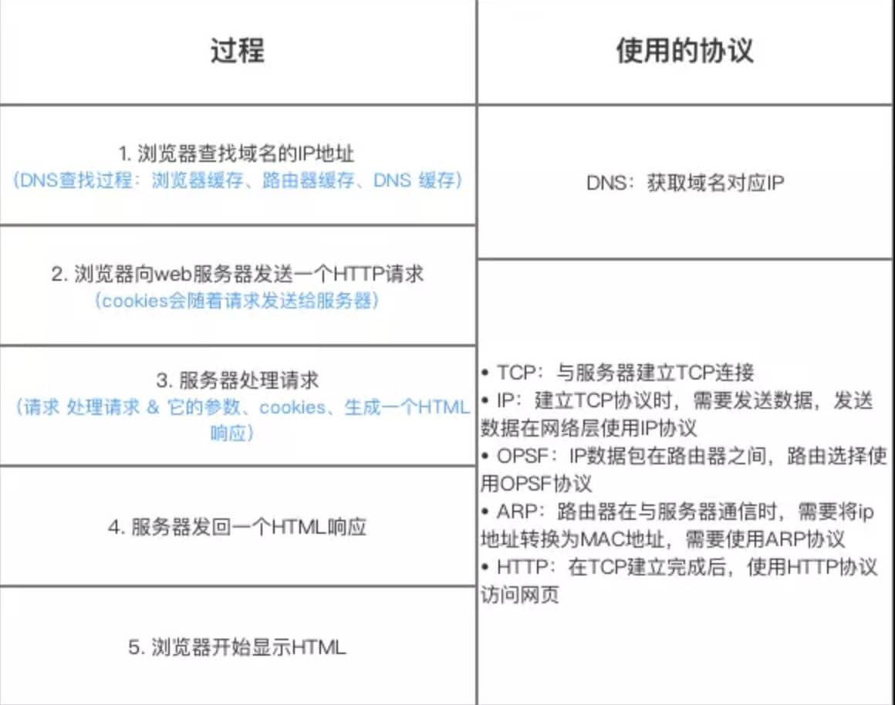

# HTTP

## 1. 背景：

- 规范超文本传输

## 2. 基本信息：

- 应用层协议，以 TCP 协议（传输层）为基础，默认端口 80

## 3. 版本：

- 1.0
  - 短连接，TCP 协议的短连接。每次请求重新建立 TCP 连接
- 1.1
  - 长连接
  - 请求头添加了 Host 字段。背景：域名系统（DNS）允许多个主机名绑定到同一个 IP 地址上，但是 HTTP/1.0 并没有考虑这个问题）
  - 队头阻塞：【HTTP 层】
- 2.0
  - 多路复用：同时传输多个请求和响应
  - 二进制帧传输，更加紧凑和高效。
  - 队头阻塞：允许多个请求和响应在单个 TCP 连接上并行交错传输，解决 1.1 的队头阻塞。但存在 TCP 的队头阻塞。【数据帧】：`stream_id + length`标识此部分
  - 【TCP 层队头阻塞】：不丢失、不重复、按序到达。由于丢失或延迟的数据包，也最终导致 HTTP 队头阻塞！TCP 保持数据传输有序。
- 3.0
  - QUIC：包括 TCP 的所有特性（可靠性、拥塞控制、流量控制、排序等）的最佳版本，以及更多其他特性。
  - 不允许未加密连接。
  - QUIC 数据可能不再以与发送时完全相同的顺序发送到浏览器。
  - QUIC 在单个资源流中保留了顺序，但不再跨单个流（individual streams）进行排序。
- 队头阻塞：[队头阻塞](https://zhuanlan.zhihu.com/p/330300133)
