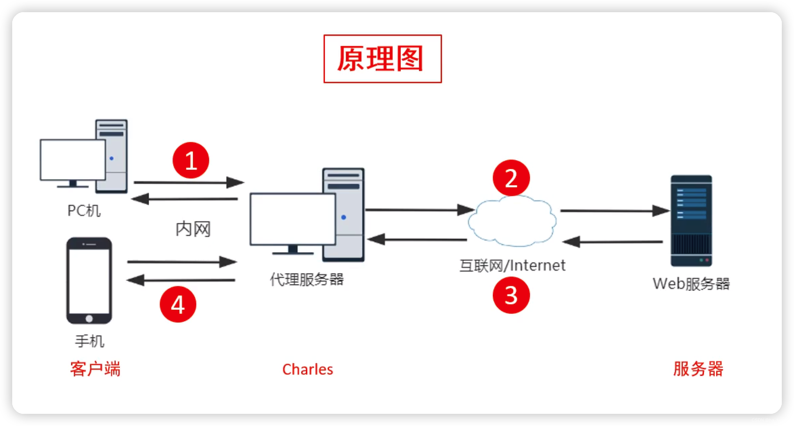

## Q1：Charles代理，手机需要安装证书，原因是https协议中的ssl加密吗？
>**A：** Charles 代理需要手机安装证书的根本原因是 HTTPS 的 SSL/TLS 加密机制。

1. 首先了解HTTPS的加密流程：
    - ​客户端（手机）​​ 与 ​服务器​ 建立连接时，会通过TLS握手**​协商加密参数**（如密钥交换算法、对称加密算法）。
    - 服务器返回**​数字证书**​（包含公钥），客户端验证证书合法性（如是否由受信任的 CA 签发）。
    - 客户端生成 ​随机对称密钥，用服务器的公钥加密后传给服务器，后续通信使用该密钥加密数据。

2. 抓包的原理是什么？
    - 手机信任 Charles 的证书，将 Charles 伪装成“合法服务器”。
    - Charles 解密手机发出的请求，再以自己的身份向真实服务器发起 HTTPS 请求（重新加密）。
    - 服务器返回的数据由 Charles 解密后，再加密转发给手机。

## Q2：安装证书后charles和手机的加密方式相同吗？
> **A：** 加密方式相同，但信任链不同
1. 使用了两套独立的TLS连接
    - Charles 需要 ​两套独立的 TLS 连接​：
        - 手机 ↔ Charles（Charles 伪造服务器证书）。
        - Charles ↔ 真实服务器（Charles 作为客户端发起正常 HTTPS 请求）。
    - 手机安装 Charles 证书后，会信任 Charles 伪造的证书，从而允许解密流量。

2. 手机配置
    - 安装 Charles 根证书​：
        - 将 Charles 的 CA 证书（如 charles-proxy-ssl-proxying-certificate.pem）安装到手机的 ​受信任根证书存储区。
        - iOS 需通过 Safari 下载安装，Android 需手动导入到系统证书或应用信任库。
    - ​配置代理​：
        - 手机 Wi-Fi 设置中，将 HTTP 代理指向 Charles 的 IP 和端口（默认 8888）。
3. Charles

    - ​拦截请求​：
        - 手机发起 HTTPS 请求时，Charles 会拦截并伪造服务器证书（如将 example.com 的证书替换为自己的证书）。
        - 由于手机信任 Charles 的 CA 证书，会认为伪造的证书合法。
    - ​解密与转发​：
        - Charles 用与手机协商的对称密钥解密请求，查看明文内容。
        - Charles 以自己的身份向真实服务器发起 HTTPS 请求（重新协商密钥并加密）。
        - 服务器返回的数据由 Charles 解密后，再用与手机协商的密钥加密转发给手机。

    