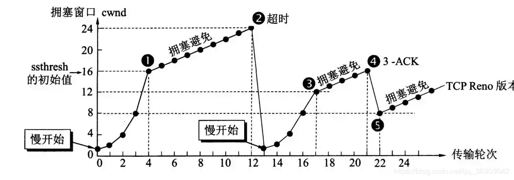

# TCP/UDP

1.  三次握手：

    - 目的：确保双发收发正常
    - 【1】A 发给 B 的 SYN 中途被丢，没有到达 B。A 会周期性超时重传，直到收到 B 的确认。
    - 【2】B 发给 A 的 SYN-ACK 中途被丢，没有到达 A。A，B 会周期性超时重传，直到收到 A 的确认。A认为自己的sync没有发送到，B认为自己的sync+ack没有发送到。双端都重试。
    - ACK 为确认帧，SYN 为建立并确认从服务端到客户端的通信。
    - 【3】A 发给 B 的 ACK 中途被丢，没有到达 BA 发完 ACK，单方面认为 TCP 为 Established 状态，而 B 显然认为 TCP 为 Active 状态：
    - 若双方都无数据发送：B 会重新发送第二个包，sync+ack
    - 若 A 发送给 B：B 收到 A 的数据和 ACK 确认包，切换为 Established 状态
    - 若 B 发送给 A：无法发送出去，周期性超时重传 SYN+ACK 直到收到 A 的 ACK

2.  四次挥手：

    - 目的：确保双方连接关闭，双方都有可能在发送数据，需要双方发送结束后关闭连接。
    - 【1】客户端发送一个 FIN（SEQ=x）关闭客户端到服务端的数据传送。客户端进入 FIN-WAIT-1 状态。
    - 如果客户端未收到 ACK 则再次重试 FIN 发送
    - 【2】服务端收到这个 FIN（SEQ=X） 标志的数据包，它发送一个 ACK （ACK=x+1）。然后服务端进入 CLOSE-WAIT 状态，客户端进入 FIN-WAIT-2 状态。
    - 【3】服务端发送一个 FIN (SEQ=y)标志，请求关闭连接，然后服务端进入 LAST-ACK 状态。
    - 【4】客户端发送 ACK (ACK=y+1)标志，然后客户端进入 TIME-WAIT 状态，服务端在收到 ACK (ACK=y+1)标志的数据包后进入 CLOSE 状态。此时如果客户端等待 2MSL 后依然没有收到回复，就证明服务端已正常关闭，随后客户端也可以关闭连接了。

    > ✅
    > MSL(Maximum Segment Lifetime) : 一个片段在网络中最大的存活时间，2MSL 就是一个发送和一个回复所需的最大时间。如果直到 2MSL，Client 都没有再次收到 FIN，那么 Client 推断 ACK 已经被成功接收，则结束 TCP 连接。

    > ❗️
    > <u>**只要四次挥手没有结束，双方都可发送数据**</u>。
    >   >&nbsp;&nbsp;&nbsp;&nbsp;<u>**在握手和挥手中，ACK 是没有重传机制的**</u>，所以只能是上一个数据包重新发送。

3.  可靠性保证：

    - 基于数据块传输：应用数据被分割为 TCP 数据块（报文段、段）。
    - 失序数据重排和去重：每个包一个序列号，有了序列号能够将接收到的数据根据序列号排序，并且去掉重复序列号的数据就可以实现数据包去重。
    - 校验和：保证首部和数据部分的校验和。目的是检测数据在传输过程中的任何变化。
    - 重传机制：基于计时器（超时重传）
    - 流量控制 : TCP 连接的每一方都有固定大小的缓冲空间，TCP 的接收端只允许发送端发送接收端缓冲区能接纳的数据。当接收方来不及处理发送方的数据，能提示发送方降低发送的速率，防止包丢失。TCP 使用的流量控制协议是可变大小的滑动窗口协议（TCP 利用滑动窗口实现流量控制）。
    - 拥塞控制：
      - 网络拥塞时减少数据发送，根据网络情况，发送端维护一个拥塞窗口。
      - 接收方的接收能力-滑动窗口-还有多少缓冲区可用接收。
      - 发送方发送数据的大小是滑动窗口和拥塞窗口的最小值，这样可以保证发送方既不会超过接收方的接收能力，也不会造成网络的过度拥塞。

4.  流量控制（PtoP）

    - 背景：双方发收速率不一致
    - 解决： 
      滑动窗口 - 发送端  - 已经发送并且确认的 TCP 段（已经发送并确认）；  - 已经发送但是没有确认的 TCP 段（已经发送未确认）；  - 未发送但是接收方准备接收的 TCP 段（可以发送）；  - 未发送并且接收方也并未准备接受的 TCP 段（不可发送）。 
      
    - 滑动窗口 - 接收端 

      - 已经接收并且已经确认的 TCP 段（已经接收并确认）； 
      - 等待接收且允许发送方发送 TCP 段（可以接收未确认）； 
      - 不可接收且不允许发送方发送 TCP 段（不可接收）。 

        

5.  拥塞控制
    TCP 发送方要维持一个 拥塞窗口(cwnd) 的状态变量。拥塞控制窗口的大小取决于网络的拥塞程度，并且动态变化。发送方让自己的发送窗口取为拥塞窗口和接收方的接受窗口中较小的一个。 
    

    - 慢开始：慢开始试探网络，指数增长
    - 拥塞避免：到达阈值，每次 rtt 加 1
    - 快重传与快恢复
